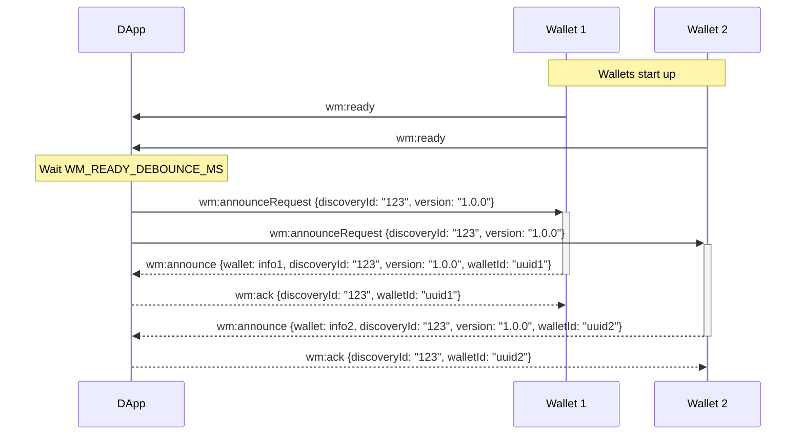

# Wallet Discovery Protocol

A TypeScript library implementing a protocol for discovering web3 wallets in both browser extensions and web applications. This package enables DApps to discover available wallets and wallets to announce their presence to DApps.

## Overview

The Wallet Discovery Protocol implements a simple event-based communication system between DApps and wallets. It consists of two main components:

- **DApp Server** (`DiscoveryListener`): Listens for wallet announcements and maintains a list of available wallets
- **Wallet Client** (`DiscoveryAnnouncer`): Announces wallet presence and responds to discovery requests

The protocol uses browser events for communication, making it compatible with both browser extensions and web-based wallets.

## Protocol Events

The protocol uses the following events:

- `wm:discovery:ready` - Wallet signals it's ready for discovery
- `wm:discovery:request` - DApp requests wallet announcements
- `wm:discovery:response` - Wallet responds with its information
- `wm:discovery:ack` - DApp acknowledges wallet discovery

## Protocol Flow

1. Wallets initialize and dispatch a "ready" event
2. DApp waits for a short debounce period
3. DApp broadcasts a discovery request
4. Wallets respond with their information
5. DApp acknowledges each wallet response



## Usage

### For DApps

DApps use the `DiscoveryListener` class to discover available wallets:

```typescript
import { createDiscoveryListener } from 'wallet-discovery-protocol';

// Initialize the listener
const listener = createDiscoveryListener(['eip155', 'solana'], (wallet) => {
  console.log('New wallet discovered:', wallet);
});

// Start listening for wallet announcements
listener.start();

// Access discovered wallets at any time
console.log(listener.wallets);

// Stop listening when done
listener.stop();

```

### For Wallets

The protocol supports two types of wallets:

### Web Wallets

```typescript
import { createWebWalletAnnouncer } from 'wallet-discovery-protocol';

// Initialize the announcer
const announcer = createWebWalletAnnouncer(
  'My Wallet',
  'https://my-wallet.com/icon.png',
  'com.my-wallet',
  'https://my-wallet.com',
  ['eip155', 'solana']
);

// Start announcing
announcer.start();

// Stop announcing when done
announcer.stop();
```

### Extension Wallets

```typescript
import { createExtensionWalletAnnouncer } from 'wallet-discovery-protocol';

// Initialize the announcer
const announcer = createExtensionWalletAnnouncer(
  'My Wallet',
  'https://my-wallet.com/icon.png',
  'com.my-wallet',
  ['eip155', 'solana'],
  'abcdef123456'
);

// Start announcing
announcer.start();

// Stop announcing when done
announcer.stop();
```

## Wallet Information Types

The protocol supports two types of wallets:

### Browser Extension Wallets
```typescript
interface ExtensionWalletInfo {
  name: string;
  icon: string;
  rdns: string;
  extensionId?: string;
  code?: string;
  technologies?: string[];
}
```

### Web Wallets
```typescript
interface WebWalletInfo {
  name: string;
  icon: string;
  rdns: string;
  url?: string;
  technologies?: string[];
}
```
## Technology Filtering
Wallets will only respond to discovery requests if they meet the specified technology requirements. If a wallet does not support the requested technologies, it will not announce itself. Additionally, wallets will only announce themselves once to each server. If an additional announcement is needed, possibly due to different technology requirements, a new DiscoveryListener should be created and used.

## Error Handling

The protocol includes built-in validation for all events and wallet information. Invalid events or wallet information are silently ignored to maintain stability.

## Best Practices

1. Always call `stop()` when cleaning up to prevent memory leaks
2. Use the callback option in `DiscoveryListener` for real-time wallet updates
3. Implement proper error handling for wallet information validation before using in your dapp
4. Consider using technology filtering to only discover relevant wallets
5. Wallets will only respond if they meet the requirements specified.
6. Wallets will only announce themselves once to each server. If an additional announcement is needed (possibly a different technology requirement), a new discovery listener should be created and used.

## Contributing

Contributions are welcome! Please see our contributing guidelines for details.


