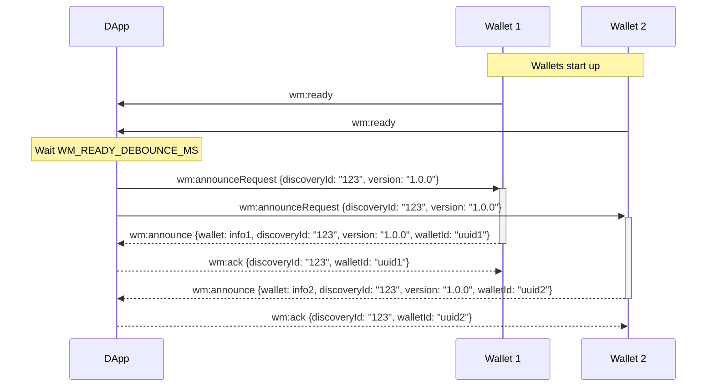

```mermaid
sequenceDiagram
    participant D as DApp
    participant W1 as Wallet 1
    participant W2 as Wallet 2
    
    Note over W1,W2: Wallets start up
    W1->>D: wm:ready
    W2->>D: wm:ready
    
    Note over D: Wait WM_READY_DEBOUNCE_MS
    
    D->>+W1: wm:announceRequest {discoveryId: "123", version: "1.0.0"}
    D->>+W2: wm:announceRequest {discoveryId: "123", version: "1.0.0"}
    
    W1-->>-D: wm:announce {wallet: info1, discoveryId: "123", version: "1.0.0", walletId: "uuid1"}
    D-->>W1: wm:ack {discoveryId: "123", walletId: "uuid1"}
    
    W2-->>-D: wm:announce {wallet: info2, discoveryId: "123", version: "1.0.0", walletId: "uuid2"}
    D-->>W2: wm:ack {discoveryId: "123", walletId: "uuid2"}
```